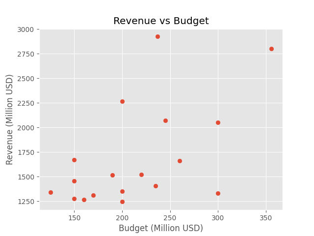
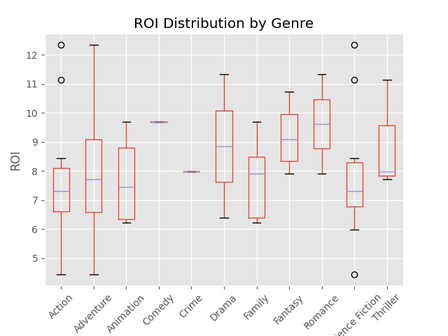
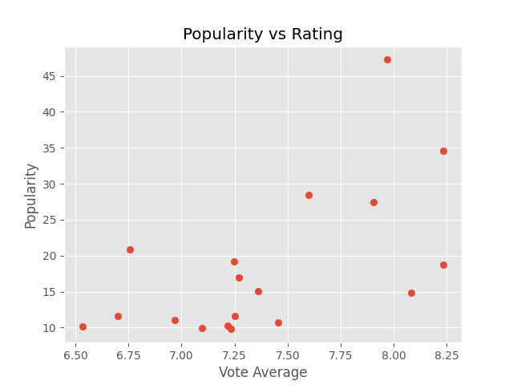
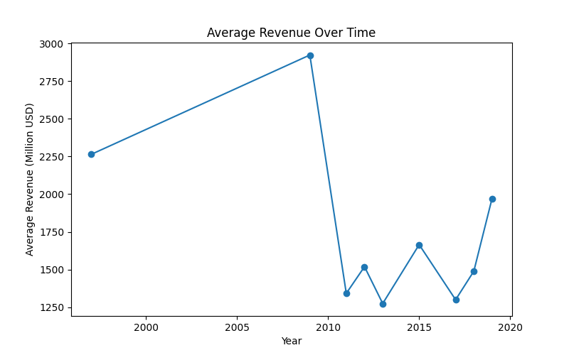
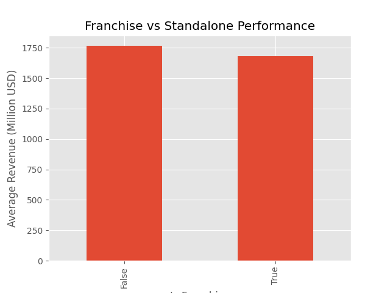

# TMDB Movie Data Analysis using Python, Pandas, and API

## Introduction
 The movie industry generates billions of dollars every year. Understanding the factors that influence movie success can help explain trends in revenue, popularity and profitability.

 This project builds a complete data analysis pipeline using Python and TMDB API. The pipeline extracts movie data, cleans the dataset, performs analysis, and creates visualizations.

 ## Data Extraction

 The movie data was obtained from the TMDB API. The following movie IDs were: 299534, 19995, 140607, 299536, 597, 135397, 420818, 24428, 168259, 99861, 284054, 12445, 181808, 330457, 351286, 109445, 321612, 260513.

 The data was stored in the Pandas DataFrame and saved as raw_movies.csv in data folder.

 ## Data cleaning and transformation
### Removed unnecessary columns

1. adult
2. imdb_id
3. original_title
4. video
5. homepage

### Flatten JSON columns

The following JSON columns were converted into readable text:

1. genres
2. production_companies
3. production_countries
4. spoken_languages
5. belongs_to_collection

### Data type conversion

Some columns were converted to the correct data types to make the analysis easier.

1. `release_date` was converted to datetime so that the movie release years could be analyzed.
2. `budget`, `revenue`, `runtime`, `popularity`, `vote_count` and `vote_average` were converted to numeric values.
3. Invalid values were converted to `NaN` using `errors="coerce"`

### Feature Engineering

New variables were created to improve the analysis. Two new columns were generated:

1. `budget_musd`: movie budget converted to million USD
2. `revenue_musd`: movie revenue converted to million USD

This was done using the following transformation:

budget_musd = budget / 1,000,000  
revenue_musd = revenue / 1,000,000

Using million USD values makes the financial analysis easier to read and compare.

Additional variables were also created during analysis:

- `profit_musd` = revenue_musd − budget_musd
- `roi` = revenue_musd / budget_musd

These variables allow us to measure **movie profitability and return on investment**.

## KPI Analysis

Key Performance Indicators (KPIs) were used to evaluate the performance of the movies in the dataset. KPIs help measure how successful a movie is based on financial performance, popularity, and audience ratings.

In this project, several KPIs were calculated to identify the best performing movies. These indicators include revenue, profit, return on investment (ROI), popularity, and ratings.

To simplify the analysis, a **user-defined function (UDF)** was created to rank movies based on different metrics such as revenue, profit, and ROI.

```python
def rank_movies(df, column, ascending=False, n=10):
    return df.sort_values(column, ascending=ascending)[["title", column]].head(n)
```
## Franchise Analysis

The dataset was used to compare franchise movies and standalone movies.

Results show that:

- Both franchise and standalone movies generate high revenue
- There is no large difference in average revenue in this dataset
- Performance depends on individual movies rather than category alone
## Data Visualization

Several visualizations were created to explore relationships between important movie variables.

## Revenue vs Budget

The following scatter plot shows the relationship between movie budget and revenue. Movies with larger budgets tend to generate higher revenue.



**Figure 1:** Relationship between movie budget and revenue.

Movies with higher production budgets generally generate higher box office revenue, although there are some variations. This indicates a positive relationship between budget and revenue.

## ROI Distribution by Genre

Figure 2 shows how the return on investment (ROI) varies across different movie genres.



**Figure 2:** Distribution of ROI across movie genres.

Some genres show higher median ROI values than others, meaning they tend to generate more revenue compared to their production budget. The variation also shows that profitability can differ significantly between genres.
---
## Popularity vs Rating

Figure 3 shows the relationship between audience ratings and movie popularity.

Movies with higher ratings tend to have higher popularity scores. However, the relationship is not strictly linear, as some movies with average ratings still achieve high popularity.



**Figure 3:** Relationship between movie ratings and popularity.
---
## Yearly Revenue Trend

This line chart shows how the total movie revenue changes across different release years.

The chart highlights how certain years generate higher total revenue due to the release of major blockbuster movies.



**Figure 4:** Total box office revenue by release year.

---
## Franchise vs Standalone Movies

This bar chart compares the average revenue of franchise movies and standalone movies.

The results show that both types of movies generate high revenue, although franchise movies often have larger budgets and strong audience recognition.



**Figure 5:** Comparison of average revenue between franchise and standalone movies.

The bar chart shows that both franchise and standalone movies have comparable average revenue, suggesting that success is not limited to franchise films.

## Conclusion

This project demonstrates how to build a complete movie data analysis pipeline using Python, Pandas, and the TMDB API.

The pipeline was used to collect movie data, clean and transform the dataset, calculate key performance indicators, and create visualizations.

The analysis shows that:

- Movies with larger budgets tend to generate higher revenue, indicating a positive relationship between investment and earnings.
- Return on investment (ROI) varies across genres, showing that profitability depends on the type of movie.
- The relationship between popularity and rating exists but is not strictly linear.
- Both franchise and standalone movies perform strongly, with no significant difference in average revenue in this dataset.
- Certain directors and franchises contribute significantly to overall movie success.

This project highlights how data analysis can be used to better understand movie industry performance and supports data-driven decision-making.